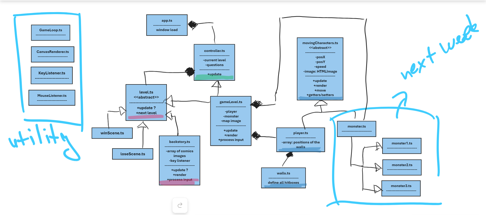

<!-- ABOUT THE PROJECT -->
## About The Project

An educational game that develops children technical skills (specifically in MS Apps - MS Word, MS PowerPoint, MS Excel)



<!-- GETTING STARTED -->
## Getting Started

To get a local copy up and running follow these simple example steps.

### Installation

1. Clone the repo
   ```sh
   git clone https://github.com/HZ-OOP-2324/oop-team01.git
   ```
2. Install NPM packages
   ```sh
   npm install
   ```
3. Run NPM packages <br><br>
   Make manual update every time you make a change.
   ```sh
   npm run build
   ```
   Updates the application automatically every time you make a change.
   ```sh
   npm run watch
   ```

<!-- ACKNOWLEDGMENTS -->
## Acknowledgments

What have we used as resources for our project!

Game Classes:
* Game.ts - created by Daan de Waard
* CanvasRenderer.ts - created by Frans Blauw
* KeyListener.ts - created by Frans Blauw and BugSlayer
* MouseListener.ts - created by Frans Blauw

Photos:
* [English flag](https://en.wikipedia.org/wiki/Union_Jack#/media/File:Flag_of_the_United_Kingdom.svg)
* [Ducth flag](https://en.wikipedia.org/wiki/Flag_of_the_Netherlands#/media/File:Flag_of_the_Netherlands.svg)
* [Boy character 1](https://www.freepik.com/free-vector/young-smart-boy-character-with-different-facial-expression-hand-poses_18779051.htm#page=3&query=child%20character%20animation&position=22&from_view=search&track=ais&uuid=23465a07-fa78-453e-9af3-2c5478a404ad)
* [Boy character 2](https://www.freepik.com/free-vector/young-smart-boy-character-with-different-facial-expression-hand-poses_18779049.htm#page=3&query=child%20character%20animation&position=29&from_view=search&track=ais&uuid=23465a07-fa78-453e-9af3-2c5478a404ad)
* [Girl character 1](https://www.freepik.com/free-vector/young-smart-girl-character-with-different-facial-expression-hand-poses_18779047.htm#page=3&query=child%20character%20animation&position=33&from_view=search&track=ais&uuid=23465a07-fa78-453e-9af3-2c5478a404ad)
* [Girl character 2](https://www.freepik.com/free-vector/young-smart-girl-character-with-different-facial-expression-hand-poses_18779045.htm#query=Young%20smart%20girl%20character&position=4&from_view=author&uuid=ad0d10e9-06ef-4d65-ac25-ebf141aca5db)
* [Monsters](https://www.freepik.com/free-vector/flying-cartoon-monsters-set-kids-party-flying-monsters-with-wing-illustration-monster-character_13031454.htm#query=monster%20character%20assets&position=20&from_view=search&track=ais&uuid=18ba43a4-8482-495b-9038-1ec4f6a32fce)
* [Park](https://www.freepik.com/free-vector/city-park-with-green-trees-grass-wooden-bench-lanterns-town-buildings-skyline_12925232.htm#query=park%20cartoon&position=0&from_view=search&track=ais&uuid=67732c8a-6211-48ae-bd25-7dd9b2068287)
* [Dark World](https://www.freepik.com/free-vector/flying-magic-castle-night-bottom-up-view-fairy-palace-float-dark-sky-piece-rock-mountain-gorge_12407853.htm#query=dark%20world%20cartoon&position=15&from_view=search&track=ais&uuid=acd01b6e-fd7d-4180-b6ee-39dc0237865b)
* [Labyrinth](https://www.freepik.com/free-vector/dark-cave-with-some-dark-tree-cartoon-style-scene_8917516.htm#query=dark%20labyrinth%20cartoon&position=25&from_view=search&track=ais&uuid=f156dc6b-1f61-4e52-91ea-744d356fc11d)
* [Purple magical texture](https://www.freepik.com/free-photo/blue-liquid-marble-abstract-background_17121399.htm#from_view=detail_alsolike)
* [Hero background](https://www.freepik.com/free-vector/comic-style-background-flat-design_11773472.htm#query=hero%20background%20cartoon&position=37&from_view=search&track=ais&uuid=1fbbb55c-4a3e-4e7e-bacd-b595e4a9b6c1)
* [Keyboard photos](https://www.cleanpng.com/png-computer-keyboard-arrow-keys-button-1612644/download-png.html)
* [Beginning magical world](https://www.freepik.com/free-vector/fantasy-forest-pond-cartoon-landscape-background-magic-garden-night-with-beautiful-enchanted-lake-water-tree-branches-firefly-glow-nighttime-adventure-place-fairytale-legend_79004297.htm#query=Fantasy%20forest%20pond%20cartoon%20landscape%20background%20magic%20garden%20at%20night%20with%20beautiful%20enchanted%20lake%20water%20and%20tree&position=7&from_view=search&track=ais&uuid=4d6cb463-3384-4c19-9183-d8d7c013408c)
* [Cage](https://pngimg.com/image/41387)